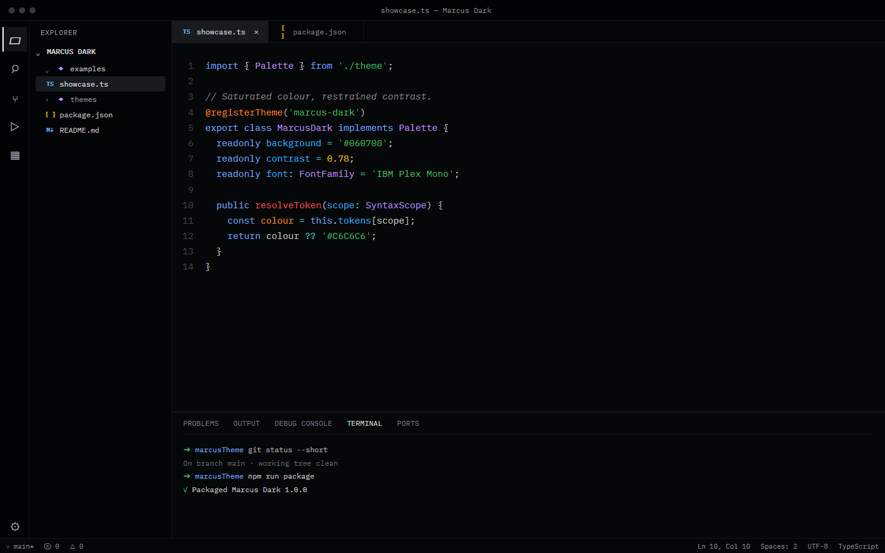
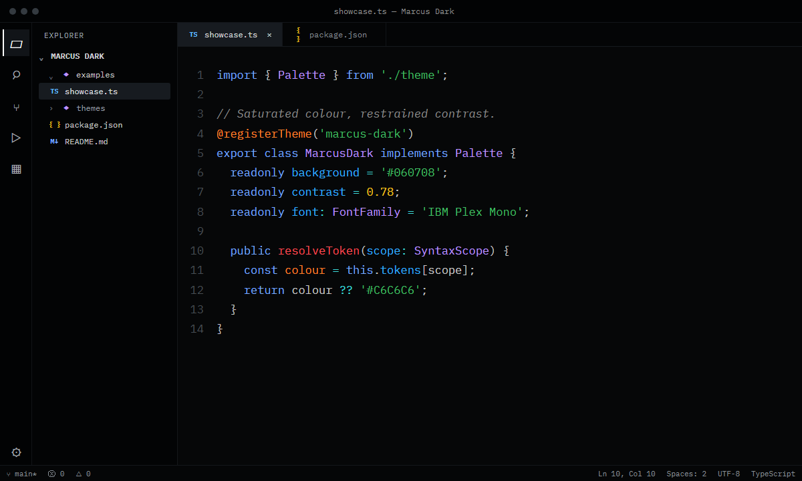

# Marcus Dark

A near-black VS Code theme for long sessions—low glare, quiet surfaces, readable text, and saturated syntax colour where it matters.



## Designed to stay out of the way

- **Near-black, not high-contrast.** Editor and terminal surfaces sit at `#060708`, with darker navigation and restrained separators.
- **Clear syntax hierarchy.** Functions, keywords, types, constants, numbers, strings, and properties stay visibly distinct without drifting into pastel tones.
- **Purposeful interaction states.** Hovered, selected, focused, and active elements use separate surface levels instead of stacked outlines.
- **A companion icon theme.** Marcus Seti retains familiar file glyphs while lifting their colour and clarity against the dark Explorer.
- **Built around IBM Plex Mono.** The theme works with any monospace font, but its spacing and readability were tuned with IBM Plex Mono in mind.

## Syntax palette



The syntax colours use exact values from the IBM Carbon palette:

| Role | Colour |
| --- | --- |
| Foreground | Carbon Gray 30 · `#C6C6C6` |
| Comments | Carbon Gray 50 · `#8D8D8D` |
| Functions | Carbon Red 50 · `#FA4D56` |
| Keywords | Carbon Blue 40 · `#78A9FF` |
| Types and imports | Carbon Purple 40 · `#BE95FF` |
| Constants and decorators | Carbon Orange 40 · `#FF832B` |
| Numbers | Carbon Yellow 30 · `#F1C21B` |
| Properties | Carbon Cyan 40 · `#33B1FF` |
| Strings | Carbon Green 40 · `#42BE65` |
| Operators and regular expressions | Carbon Teal 30 · `#3DDBD9` |

## Installation

1. Open the Extensions view in VS Code.
2. Search for **Marcus Dark**.
3. Install the extension.
4. Choose **Marcus Dark** from `Preferences: Color Theme`.
5. Choose **Marcus Seti** from `Preferences: File Icon Theme`.

You can also install a packaged `.vsix` from the repository releases using `Extensions: Install from VSIX...` in the Command Palette.

## Recommended settings

VS Code themes cannot change your editor font automatically. For the intended appearance, add:

```json
{
  "editor.fontFamily": "'IBM Plex Mono', Consolas, monospace",
  "editor.fontSize": 14,
  "editor.fontLigatures": true
}
```

## Contributing

If a language scope, extension view, or workbench state looks wrong, please [open an issue](https://github.com/marcus-miccelli/marcusTheme/issues) with a screenshot and the relevant language or extension name.

## License

Marcus Dark is available under the [MIT License](./LICENSE). The companion file-icon theme includes Seti-derived assets; attribution is recorded in [Third-Party Notices](./THIRD_PARTY_NOTICES.md).
